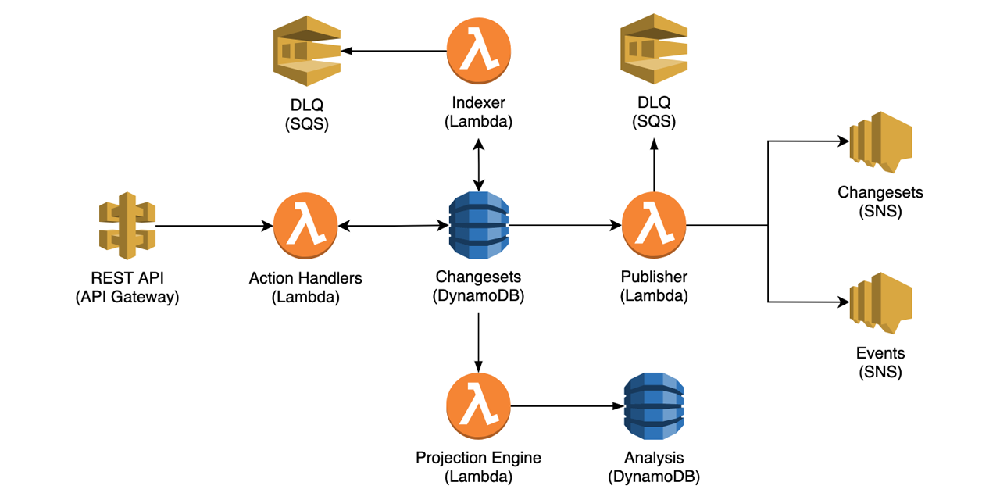

# Elastic Event Store

A fully serverless storage for event sourcing-based systems.



## Table of Contents

- [What is Event Sourcing?](#WhatIsEventSourcing)
- [What is Event Store?](#WhatIsEventStore)
- [Getting Started](#GettingStarted)
  * [Installing](#Installing)
  * [Using](#Using)
- [Push Subscriptions](#PushSubscriptions)
- [Pull Subscriptions](#PullSubscriptions)
- [Arhictecture](#Arhictecture)
- [Data Model](#DataModel)
- [Ordering Guarantees](#OrderingGuarantees)
- [Testing](#Testing)
- [Limitations](#Limitations)

<a name="WhatIsEventSourcing"/>

## What is Event Sourcing?

Traditionally, software systems operate on state-based data. In other words, business entities and concepts are represented as a snapshot of their *current* state. E.g.:

| Id  | Name       | Team              |
| --- | ---------- | ----------------- |
| 1   | Gillian    | Administration    |
| 2   | Krzysztof  | Accounting        |
| 3   | Robyn      | Frontend          |

In the above example, all we know about the data is its current state. *But how did it get to the current state?* - We don't know. All we know is the entity's current state. The Event Sourcing pattern does answer this and many other questions.

The Event Sourcing pattern introduces the dimension of time into the modeling of business entities and their lifecycles. Instead of capturing an entity's current state, an event-sourced system keep a transactional record of all events that have occurred during an entity's lifecycle. For example:

```
{ "id": 3, "type": "initialized", "name": "Robyn", "timestamp": "2021-01-05T13:15:30Z" }
{ "id": 3, "type": "assigned", "team": "Frontend", "timestamp": "2021-01-05T16:15:30Z" }
{ "id": 3, "type": "promoted", "position": "team-leader", "timestamp": "2021-01-22T16:15:30Z" }

```

Modeling and persisting the events captures what exactly happened during an entity's lifecycle. The events are used as the system's **source of truth**. Hence the name of the pattern -- event sourcing.

Not only we can derive the current state by sequentially applying the events, but the flexible events-based model allows projecting different state models that are optimized for different tasks.

Finally, Event Sourcing is **not** Event-Driven Architecture(EDA):

> EventSourcing is not Event driven architecture. The former is about events _inside_ the app. The latter is about events _between_ (sub)systems
>
> ~ [@ylorph](https://twitter.com/ylorph/status/1295480789765955586)

<a name="WhatIsEventStore"/>

## What is Event Store?

An event store is a storage mechanism optimized for event sourcing-based systems. An event store should provide the following functionality:

1. Appending events to a stream (stream = events of a distinct entity).
2. Read events from a stream.
3. Concurrency management to identify collisions when two processes are appending to the same stream simultaneously.
4. Allow enumerating events across all streams in the store, e.g., for generating CQRS projections.
5. Pushing newly committed events to the interested subscribers.

All of the above functions are supported by the Elastic Event Store. Let's see how you can spin up an instance and start event *sourcing* in no time.

<a name="GettingStarted"/>

## Getting Started

<a name="Installing"/>

### Installing

1. Install [AWS Serverless Application Model(SAM) CLI] (https://docs.aws.amazon.com/serverless-application-model/latest/developerguide/serverless-sam-cli-install.html) and configure your [AWS credentials](https://docs.aws.amazon.com/cli/latest/userguide/cli-configure-files.html).

2. Clone the repository:

```sh

    $ git clone https://github.com/doitintl/elastic-event-store.git
    $ cd elastic-event-store

```

3. Build and deploy a new instance:

```sh

    $ sam build
    ...
    Build Succeeded

    $ sam deploy --guided
    ...
    Key           ApiEndpoint                                                                        
    Description   API Gateway endpoint URL for Prod stage                                      
    Value         https://XXXXXXXXXXXX.execute-api.XXXXXXXX.amazonaws.com/Prod/
    ------------------------------------------------------------------------------------

```

Pay attention to the values of ReadCapacityUnits and WriteCapacityUnits. Low values limit the event store's, too high values increase the cost.

Verify the enstallation by calling the "version" endpoint:

```sh
$ curl https://XXXXXXXXXXXX.execute-api.XXXXXXXX.amazonaws.com/Prod/version

{
    "version": "0.0.1"
}
```

<a name="Using"/>

### Using

#### 1. Submit a few changesets

Store the endpoint url you've received in the previous step (ApiEndpoint):
```sh
EES_URL=https://XXXXXXXXXXXX.execute-api.XXXXXXXX.amazonaws.com/Prod
```

```sh
$ curl $EES_URL/streams/stream-aaa-111 \
     --header 'Content-Type: application/json' \
     --request POST \
     --data @- <<BODY
{
    "metadata": {
        "command": "do_something",
        "issuedBy": "me"
    },
    "events": [
        { "type": "init", "data": 1 },
        { "type": "sell", "data": 20 },
        { "type": "buy", "data": 5 }
    ]
}
BODY
```

```sh
$ curl $EES_URL/streams/stream-aaa-222 \
     --header 'Content-Type: application/json' \
     --request POST \
     --data @- <<BODY
{
    "metadata": {
        "command": "do_something",
        "issuedBy": "me"
    },
    "events": [
        { "type": "init", "data": 1 },
        { "type": "sell", "data": 20 },
        { "type": "buy", "data": 5 }
    ]
}
BODY
```

The Elastic Event Store is opinioned about concurrency control: it is mandatory. Hence, when committing to an existing stream, you have to specify the expected last changeset of that stream:
```sh
$ curl $EES_URL/streams/stream-aaa-111\?expected_last_changeset=1 \
     --header 'Content-Type: application/json' \
     --request POST \
     --data @- <<BODY
{
    "metadata": {
        "command": "do_something_else",
        "issuedBy": "me"
    },
    "events": [
        { "type": "buy", "data": 100 },
        { "type": "buy", "data": 220 },
        { "type": "sell", "data": 15 }
    ]
}
BODY
```

#### 2. Fetch changesets belonging to one of the streams:

```sh
$ curl $EES_URL/streams/stream-aaa-111/changesets

{
    "stream_id": "stream-aaa-111",
    "changesets": [
        {
            "changeset_id": 1,
            "events": [
                {
                    "type": "init",
                    "data": 1
                },
                ...
            ],
            "metadata": {
                "command": "do_something",
                "issuedBy": "me"
            }
        },
        ...
    ]
}       
```

Or you can also fetch the events directly:

```sh
$ curl $EES_URL/streams/stream-aaa-111/events

{
    "stream_id": "stream-aaa-111",
    "events": [
        {
            "id": 1,
            "data": {
                "type": "init",
                "data": 1
            }
        },
        ...
        {
            "id": 6,
            "data": {
                "type": "sell",
                "data": 15
            }
        }
    ]
}   
```

Finally, let's see the instance's statistics:

```sh
$ curl $EES_URL/streams

{
    "total_streams": 2,
    "total_changesets": 4,
    "total_events": 12,
    "max_stream_length": 2,
    "statistics_version": 3
}
```
Note: the statistics endpoint's data is project asynchronously at a one minute interval.

<a name="PushSubscriptions"/>

## Push Subscriptions

The CloudFormation stack included two SNS topics you can use to get notifications about newly submitted changesets or events:

1. ees_changesets_XXX_XXX_.fifo - for subscribing to new changesets
2. ees_events_XXX_XXX_.fifo - for subscribing to individual events

<a name="PullSubscriptions"/>

## Pull(Catchup) Subscriptions

You can enumerate the changesets globally (across multiple streams) using the "changesets" endpoint:

```sh
$ curl $EES_URL/changesets\?checkpoint=0

{
    "checkpoint": 0,
    "limit": 10,
    "changesets": [
        ...
        {
            "stream_id": "aaa-111111",
            "changeset_id": 1,
            "events": [
                ...
            ],
            "metadata": [
                ...
            ],
            "checkpoint": 3
        }
        ....
    ],
    "next_checkpoint": 7
}
```

Notice the "next_checkpoint" value. Use it for getting the next batch of changesets.

This endpoint is crucial for generating CQRS projections. If you look in the source code, that's how the analysis model is generated -- by periodically getting the next batch of changesets and applying in them to the analysis model's state. The analysis data can be wiped off at any time, and it will be regenerated from scratch during the next iteration.

<a name="Arhictecture"/>

## Architecture


* The REST API is exposed by API Gateway.
* AWS Lambda functions host all the system's logic.
* DynamoDB is the main storage mechanism.
* DynamoDB Streams trigger Lambda functions that are publishing the new changesets and assign the globally enumerable index.
* SNS fifo topics are used for publishing newly committed changesets and events.
* SQS dead letter queues capture DynamoDB Streams events that were not processed successfully by the Lambda functions.

<a name="DataModel"/>

## Data Model

A partition in the events table represents a distinct stream of events: events that belong to a certain instance of a business entity. The partition's records are created for each transaction(commit) in the stream, and hold all the events that were committed in each individual transaction. Hence, the event store perisists many streams, a stream is composed of many changesets, and a changeset includes one or more events.

The main DynamoDB table uses the following schema:

| Column            | Type                  | Description            
| ----------------- | --------------------- | ----------------------- 
| stream_id         | Partition Key(String) | Stream ID
| changeset_id      | Sort Key(Number)      | The ID of a commit in its parent stream
| events            | JSON(String)          | The events that were committed in the transaction
| metadata          | JSON(String)          | The changeset's metadata
| timestamp         | String                | Time when the transaction was comitted
| first_event_id    | LSI(Number)           | The ordinal number of the first event in the changeset, in the context of the whole stream
| last_event_id     | LSI(Number)           | The ordinal number of the last event in the changeset, in the context of the whole stream
| page              | GSI-Partition(Number) | A global secondary index used for enumerating cross-stream changesets
| page_item         | GSI-Sort(Number)      |

<a name="OrderingGuarantees"/>

## Ordering Guarantees

1. The order of changesets and events in a stream is preserved and is strongly consistent.

2. The order of changesets across all the streams is not guaranteed to be exactly the same as the order in which the streams were updated. That said, the inter-stream order is repeatable. I.e., when calling the global changesets endpoint ("/changesets"), the changesets are always returned in the same order.

<a name="Testing"/>

## Testing

1. Populate the "SAM_ARTIFACTS_BUCKET" environment variable with the name of the S3 bucket used for storing AWS SAM artifacts:

```sh
$ SAM_ARTIFACTS_BUCKET=xxxxxxxxxxxxxxx
```

2. Initialize the testing environment stack:

```sh
$ ./deploy-test-env.sh
```

3. Run unit tests:
```sh
$ ./run-unit-tests.sh
```

4. Run unit and integration tests:
```sh
$ ./run-all-tests.sh
```

<a name="Limitations"/>

## Limitations

Since DynomoDB is used as the storage mechanism, its limitations apply to Elastic Event Store:

1. The maximum item size in DynamoDB, and hence the maximum changeset size, is 400 KB.
2. The maximum size of a DynamoDB item collection is 10GB. Hence, 10GB is the maximum size of a single stream.

Finally, as with all serverless solutions, beyond a certain scale it can be more cost-effective to use a self-managed solution.
